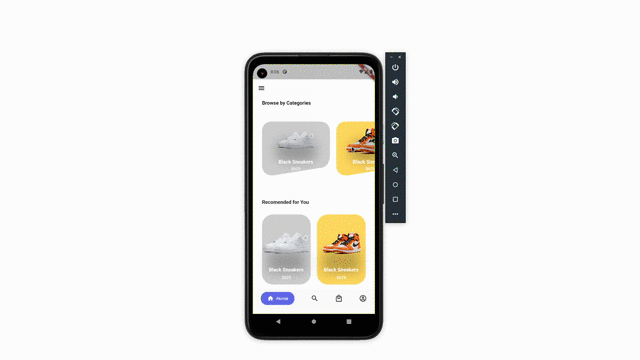

<h1 align="center">Aris Sneakers Shop</h1>

<br />
 
<p align="center">
  
  
</p>

<br />
 


## Getting Started

```dart
$ git clone https://github.com/ariscybertech/aris_sneakers_shop.git
$ flutter packages get
```
Run the application and enjoy :tada::relaxed:

<a href="https://www.buymeacoffee.com/ariscybertech"></a>

- 🌱 I’m currently learning everything
     I’m looking to collaborate with other content creators
- 🥅 2021 Goals: Contribute more to Open Source projects
- ⚡ Fun fact: I love to draw and play guitar / drums


# Desctiption
The business we are proposing to open is a high end sneaker store by the name of Laced Up.The major product in our store will be exclusive sneakers. Our two biggest brands will be Nike and Jordan. Exclusive Nike and Jordans will be in stock all the time and these exclusive shoes will bring in many customers as there is a huge market for them. This will not just be a footlocker or a champs we will be a one of a kind store . We will also have various brands of clothing in men, womens and childrens sizes. The clothing that we keep in stock will also be high end athletic apparel including Nike, UnderArmour, Adidas, etc. This clothing will bring in customers even if they are not looking for a pair of sneakers. We will also have a program where customers will be able to sell sneakers to use that we will buy and then sell in store. The sneakers that we buy will have to be in brand new condition and we will reseal them. The used sneakers will be cheaper then the new pair and also will look just as good. 
